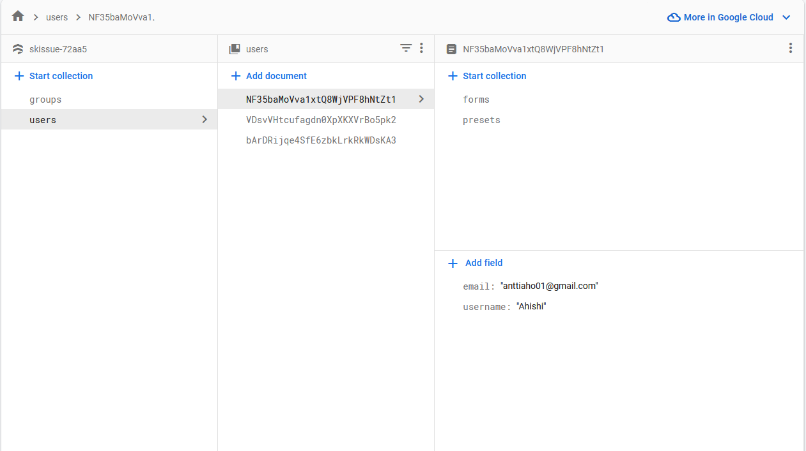
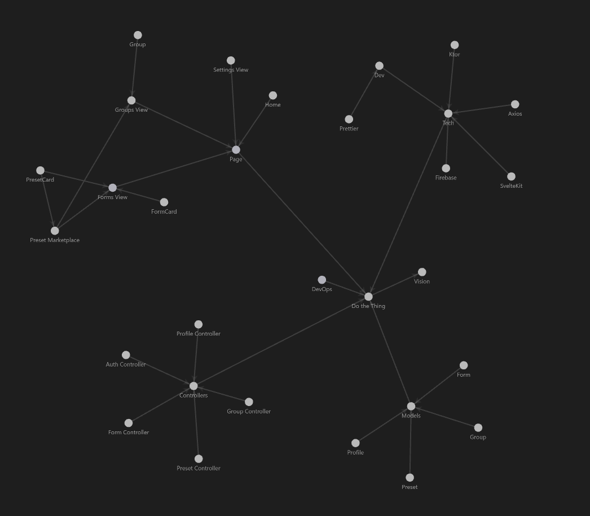

# Skissue

Project by Antti Aho, Jaakko Kuivasniemi, Andreas Lang

Once you've installed dependencies with `pnpm install` or `npm install` (npm at own risk), start a development server:

```bash
pnpm dev
```
or
```bash
npm run dev
```

## Technologies

- Firebase as a backend and an API
- Svelte for Front-end
- TailwindCSS loaded with PostCSS for CSS and styling
- Vite Server for Running

## API

API includes

- users/
- users/[uid]
- users/[uid]/presets
- users/[uid]/preset/[id]
- users/[uid]/forms
- users/[uid]/form/[id]
- groups/

API and Database deployed in cloud.
API generates paths itself.



Original Idea for Skissue made in Obsidian.

